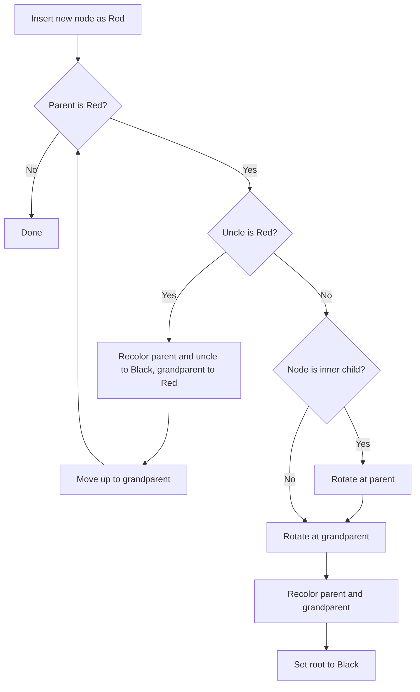

# Red-Black Tree (RBT)

*A Red-Black Tree is a self-balancing Binary Search Tree (BST) that guarantees efficient operations by keeping height close to logarithmic.*

## Why It Matters

- Maintains near-balanced structure after insertions and deletions.
- Keeps search, insert, and delete efficient.
- Common in production systems where ordered data must stay fast.

## Core Properties

| Property | Rule |
|---|---|
| Node color | Every node is either **Red** or **Black** |
| Root color | Root is always **Black** |
| Red constraint | No red node can have a red child |
| Black-height | Every path from a node to descendant NIL leaves has same number of black nodes |
| Insertion default | New node is inserted as **Red** |

## Time Complexity

| Operation | Complexity |
|---|---|
| Search | **O(log n)** |
| Insert | **O(log n)** |
| Delete | **O(log n)** |

## Balancing Tools

- **Recoloring**: change node colors to restore properties.
- **Rotations**: local structural changes.
  - *Left rotation*: fixes right-heavy pattern.
  - *Right rotation*: fixes left-heavy pattern.

## Insertion Workflow

1. Insert node using BST rules.
2. Color the new node **Red**.
3. If a rule is violated (usually red-red conflict), fix using recoloring and rotations.
4. Ensure root is **Black**.

### Diagram: Fixing Red-Red Violation (Right-Right Case)

```text
Before fix:
10(B)
   \
   20(R)
      \
      30(R)   <- violation (red parent, red child)

After left rotation at 10 + recolor:
    20(B)
   /    \
10(R)  30(R)
```

### Decision Diagram (Insert Fix)



## Search

Search is identical to BST search:

- If key is smaller, move left.
- If key is larger, move right.
- Stop when key is found or NIL is reached.

## Delete (Concept)

Deletion starts as BST deletion, then fixes black-height or color-rule violations.

1. Delete as in BST.
2. If a black node is removed or moved, properties may break.
3. Restore properties using recoloring and rotations.

*Delete fix-up is more complex than insert fix-up, but still bounded by O(log n).* 

## Python Implementation

```python
class Node:
    def __init__(self, data):
        self.data = data
        self.color = "RED"
        self.left = None
        self.right = None
        self.parent = None


class RedBlackTree:
    def __init__(self):
        self.NIL = Node(0)
        self.NIL.color = "BLACK"
        self.root = self.NIL

    # LEFT ROTATION
    def left_rotate(self, x):
        y = x.right
        x.right = y.left

        if y.left != self.NIL:
            y.left.parent = x

        y.parent = x.parent

        if x.parent is None:
            self.root = y
        elif x == x.parent.left:
            x.parent.left = y
        else:
            x.parent.right = y

        y.left = x
        x.parent = y

    # RIGHT ROTATION
    def right_rotate(self, x):
        y = x.left
        x.left = y.right

        if y.right != self.NIL:
            y.right.parent = x

        y.parent = x.parent

        if x.parent is None:
            self.root = y
        elif x == x.parent.right:
            x.parent.right = y
        else:
            x.parent.left = y

        y.right = x
        x.parent = y

    # INSERT
    def insert(self, key):
        node = Node(key)
        node.left = self.NIL
        node.right = self.NIL

        parent = None
        temp = self.root

        while temp != self.NIL:
            parent = temp
            if node.data < temp.data:
                temp = temp.left
            else:
                temp = temp.right

        node.parent = parent

        if parent is None:
            self.root = node
        elif node.data < parent.data:
            parent.left = node
        else:
            parent.right = node

        node.color = "RED"
        self.fix_insert(node)

    # FIX INSERT
    def fix_insert(self, k):
        while k.parent and k.parent.color == "RED":
            if k.parent == k.parent.parent.left:
                u = k.parent.parent.right  # uncle

                if u.color == "RED":
                    # Case 1: Recolor
                    k.parent.color = "BLACK"
                    u.color = "BLACK"
                    k.parent.parent.color = "RED"
                    k = k.parent.parent
                else:
                    if k == k.parent.right:
                        # Case 2: Left rotate
                        k = k.parent
                        self.left_rotate(k)

                    # Case 3: Right rotate
                    k.parent.color = "BLACK"
                    k.parent.parent.color = "RED"
                    self.right_rotate(k.parent.parent)

            else:
                u = k.parent.parent.left

                if u.color == "RED":
                    k.parent.color = "BLACK"
                    u.color = "BLACK"
                    k.parent.parent.color = "RED"
                    k = k.parent.parent
                else:
                    if k == k.parent.left:
                        k = k.parent
                        self.right_rotate(k)

                    k.parent.color = "BLACK"
                    k.parent.parent.color = "RED"
                    self.left_rotate(k.parent.parent)

        self.root.color = "BLACK"

    # SEARCH
    def search(self, node, key):
        if node == self.NIL or key == node.data:
            return node

        if key < node.data:
            return self.search(node.left, key)
        return self.search(node.right, key)

    # INORDER TRAVERSAL
    def inorder(self, node):
        if node != self.NIL:
            self.inorder(node.left)
            print(node.data, node.color)
            self.inorder(node.right)
```

## Sample Input and Output

```python
rbt = RedBlackTree()

rbt.insert(10)
rbt.insert(20)
rbt.insert(30)
rbt.insert(15)

rbt.inorder(rbt.root)
```

```text
10 RED
15 BLACK
20 BLACK
30 RED
```

## Summary

- Red-Black Tree is a balanced BST.
- Balance is maintained using recoloring and rotations.
- Height remains near logarithmic, so operations stay efficient.

## Real-World Uses

- Database indexing
- Linux scheduler internals
- Java `TreeMap`
- C++ STL `map` and `set`
